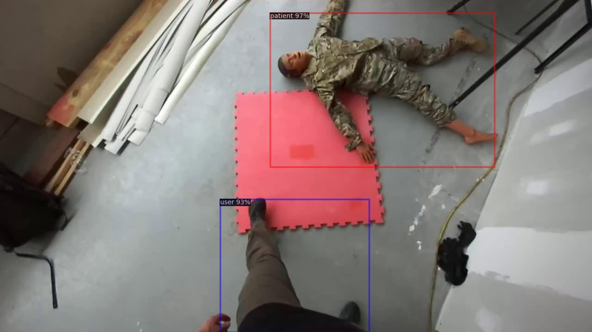
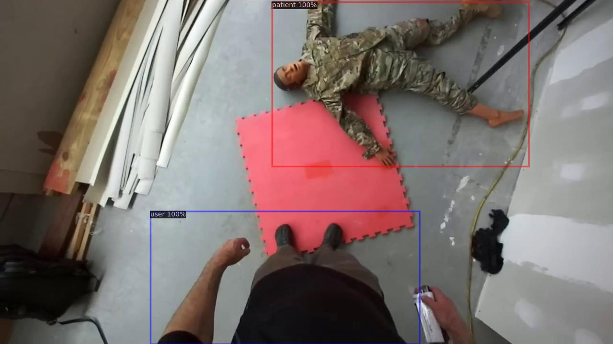
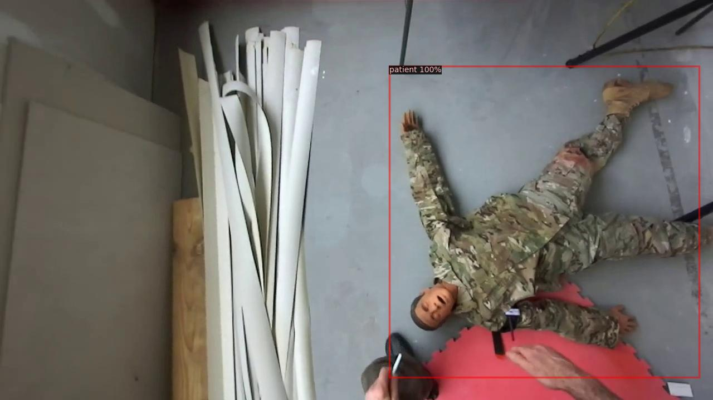
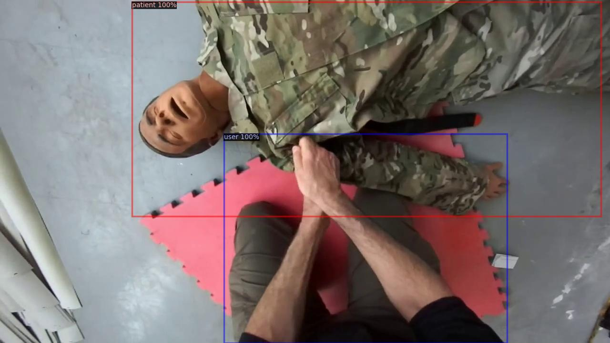

# Medical-Partial-Body-Pose-Estimation

Our model includes two stages: Partial Body Detector and pose estimator. To use the model, please follow the below instructions.

# Model Zoo
#### Partial Body Detector:
<!--
./gen_html_table.py --config 'COCO-Detection/retina*50*' 'COCO-Detection/retina*101*' --name R50 R50 R101 --fields lr_sched train_speed inference_speed mem box_AP
-->

<table><tbody>
<!-- START TABLE -->
<!-- TABLE HEADER -->
<th valign="bottom">Name</th>
<th valign="bottom">Backbone</th>
<th valign="bottom">AP@0.5:0.95</th>
<th valign="bottom">AP@0.5AP</th>
<th valign="bottom">Download</th>
<!-- TABLE BODY -->
<!-- ROW: retinanet_R_50_FPN_1x -->
<tr><td align="left">Partial Body Detector</td>
<td align="center">ResNet101</td>
<td align="center">76.67</td>
<td align="center">98.63</td>
<td align="center"><a href="https://drive.google.com/file/d/1OHAr31n41keDTJygDmFfOgsXwpriuFT9/view?usp=drive_link">model</a></td>
</tr>
</tbody></table>

#### Pose Estimator:
<!--
./gen_html_table.py --config 'COCO-Detection/retina*50*' 'COCO-Detection/retina*101*' --name R50 R50 R101 --fields lr_sched train_speed inference_speed mem box_AP
-->

<table><tbody>
<!-- START TABLE -->
<!-- TABLE HEADER -->
<th valign="bottom">Name</th>
<th valign="bottom">Backbone</th>
<th valign="bottom">AP@0.5:0.95</th>
<th valign="bottom">AP@0.5AP</th>
<th valign="bottom">Download</th>
<!-- TABLE BODY -->
<!-- ROW: retinanet_R_50_FPN_1x -->
<tr><td align="left">Pose Estimator</td>
<td align="center">VITbase</td>
<td align="center">65.21</td>
<td align="center">88.24</td>
<td align="center"><a href="https://drive.google.com/file/d/1miun_vtRODGLw0_mUOTlS3fgVwRGDzY7/view?usp=sharing">model</a></td>
</tr>
</tbody></table>


# First Stage: Partial Body Detector
Because the pose prediction of the patient needs the proposal (bounding box) as input, so we need to run run our trained Partial Body Detector to get these bounding boxes first. Following the following steps to run the detector.
## Installation

### Requirements
- Linux or macOS with Python ≥ 3.6
- PyTorch ≥ 1.8 and [torchvision](https://github.com/pytorch/vision/) that matches the PyTorch installation.
  Install them together at [pytorch.org](https://pytorch.org) to make sure of this
- OpenCV is optional but needed by demo and visualization


### Build detectron2 
Step 1: Install Pytroch: following the instruction in https://pytorch.org/ to install the latest version of pytorch.

Step 2: Following the corresponding structure, clone the code, and run:
```
cd ./Medical-Partial-Body-Pose-Estimation/

python -m pip install -e detectron2
```

### Install other dependencies
In order to make the model compatible to your syste, you may need adjust the version of some pachages:

```
pip install pillow==9.5
pip install opencv-python
pip install xtcocotoolsls
```

### Download the pre-trained model

Download our Partail Body Detecor weights in the chart in our model zoo and save it to ```./detectron2/weights``` folder.

## Run the inference of your images
The model takes input as input, if you have video, you should first split the video as images and save it to some place (please see the the third part of this repo for trainsfering between image and video).

Feel free to use our prepared data for test. You can download them at [test_data](https://drive.google.com/file/d/1mOwxB5doD-zhMsQkKte2Gt8V40oxR7PN/view?usp=sharing).

Then get the detection results by running:

```
python ./detectron2/demo/bbox_detection_medic.py --config-file configs/medic_pose/medic_pose.yaml --input you_path/*.jpg
```


## The results you will get by running the model

You will get a dict including the frame level preditions, with the structure of


```
├── demo
│   ├── bbox_detection_results
│   │   ├── vis
│   │     └── frame1_result.jpg
|   |     └── frame2_result.jpg
|   |     └── ......
│   ├── bbox_detections.json

```

You will also get frame-level prediction is ``vis`` folder (see the expample of the following Figure) and a json file named ``bbox_detections.json`` for the sebsequent pose estimation.

 
 


# Second Stage: Pose Estimator
In order to run the second stage, you should first install some packages.

## Installation

We use mmcv 1.3.9 for the experiments.

```
git clone https://github.com/open-mmlab/mmcv.git
cd mmcv
pip install -e . -v
cd ..
git clone https://github.com/Dantong88/Medical-Partial-Body-Pose-Estimation
cd ViTPose
pip install -v -e .
```

After install the two repos, install timm and einops, i.e.,
```
pip install timm==0.4.9 einops
```

### Download the pre-trained model

Download our Pose Estimator weights in the chart in our model zoo and save it to ```./ViTPose/weights``` folder.

## Run the inference of your images
The model takes images and the partial body detection results as input, feel free use oue test data (the link above) and the pre-generated detection results [] to test.

Then get the pose estimation results by running:

```
python ./ViTPose/demo/top_down_img_demo.py --json-file your_path_of_detection_results --pose_config ViTPose/configs/body/2d_kpt_sview_rgb_img/topdown_heatmap/coco
/ViTPose_base_medic_casualty_256x192.py --img-root the_path_of_input_images --out-img-root the_path_to_save_the_results
```

## The results you will get by running the model

You will get the pose estimation results as following structure:


```
├── the_path_to_save_the_results
    │── frame1_result.jpg
    └── frame2_result.jpg
    └── ......
```

We give some examples of how the results will look like:

 
 


# Image and Video Transfering (Optional)

Our Partial Body Detector and Pose Estimator both take images as input and output image-level prediction, do not fprget to change the ```path``` to the path you put/save your video.

If you need to prepare the input from a video, please run:

```
python ViTPose/demo/process_our_video.py
```

If you need to generate videos using the image-level pose prediction, please run: (change ```line23``` and ```line29``` for the image input path and video save path)

```
python /ViTPose/demo/img2video.py
```


# The Final Demonstrations You Will Get

Following the steps above, you are supposed to get a demo like [demo example](https://drive.google.com/file/d/1GNr8N5-_xP-guiXnGHeyRzsFbWXfFTPQ/view?usp=sharing) .


# Acknowledge
We acknowledge the excellent implementation from [ViTPose](https://github.com/ViTAE-Transformer/ViTPose) and [detectron2](https://github.com/facebookresearch/detectron2).


